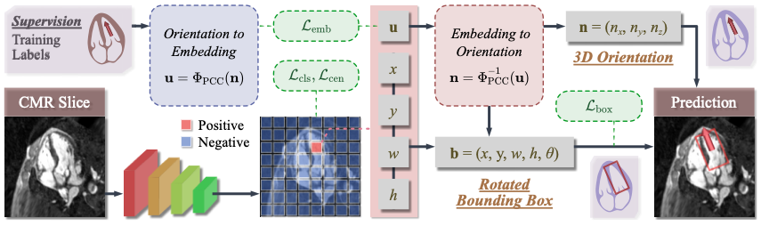
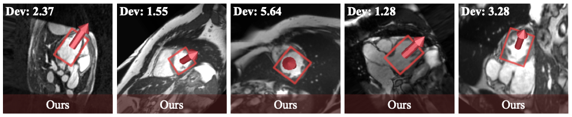

<p align="center">
  <h1 align="center">Automatic LV Localization and Short-Axis Plane Estimation from Arbitrary CMR Slice</h1>
  <p align="center">
    Yi Yu&ensp;
    Yixuan Liu&ensp;
    Ziyu Zhang&ensp;
    Parker Martin&ensp;
    Zhenyu Bu&ensp;
    Yuchi Han&ensp;
    Yuan Xue<sup>*</sup>
  </p>
  <p align="center">
    If you find our work helpful, please consider giving us a ⭐.
  </p>
</p>

## Introduction
Accurate estimation of left ventricular (LV) orientation is essential for cardiac magnetic resonance (CMR) imaging and downstream analysis. Existing methods often formulate orientation recognition as discrete view classification or rely on geometric intersections across multiple slices, which limits their ability to model continuous 3D orientation and generalize to arbitrary CMR slices.

This repository introduces a new task setting: joint LV localization and 3D orientation estimation from a single arbitrary CMR slice. We adapt representative orientation-aware detection frameworks to the CMR domain, analyze their limitations, and propose the Polar-Coupled Circular (PCC) embedding, a continuous and unambiguous orientation representation for short-axis plane estimation. We also provide a scalable benchmark generated through automatic slice sampling from volumetric CMR segmentation datasets.

The code works with **PyTorch** and is forked from [MMRotate dev-1.x](https://github.com/open-mmlab/mmrotate/tree/dev-1.x). MMRotate is an open-source toolbox for rotated object detection based on PyTorch and is part of the [OpenMMLab project](https://github.com/open-mmlab).

## Framework
<p align="center">
  
</p>
<p align="center">
  
</p>

## Installation
Please refer to [Installation](https://mmrotate.readthedocs.io/en/1.x/get_started.html) to install the pytorch, mmengine, mmcv, and mmdet. Do no install the official mmrotate. Instead, install mmrotate using this repository with the following commands:
```bash
git clone https://github.com/yuyi1005/cmr-3d-ood.git
cd cmr-3d-ood
pip install -v -e .
```

## Getting Started
Please see [Overview](https://mmrotate.readthedocs.io/en/1.x/overview.html) for the general introduction of MMRotate. 

For detailed user guides and advanced guides, please refer to MMRotate's [documentation](https://mmrotate.readthedocs.io/en/1.x/).

## Data Preparation
1. Download CMR segmentation datasets such as ACDC and M&Ms 2.
2. Modify [tools/data/cmr-3d-ood/acdc_data_conversion.sh](tools/data/cmr-3d-ood/acdc_data_conversion.sh), set the path of the ACDC dataset, and run the script to convert the segmentation dataset to an oriented detection dataset. Convert the test set as well.

## Training
```bash
python tools/train.py configs/rotated_fcos_cmr/rotated-fcos-le90_r50_fpn_rr-3x_cmr_pcc.py
```

## Testing
```bash
python tools/test.py configs/rotated_fcos_cmr/rotated-fcos-le90_r50_fpn_rr-3x_cmr_pcc.py work_dirs/rotated-fcos-le90_r50_fpn_rr-3x_cmr_pcc/epoch_36.pth
```

## Inference
```bash
python demo/image_demo.py demo/patient101_frame01-0010.png configs/rotated_fcos_cmr/rotated-fcos-le90_r50_fpn_rr-3x_cmr_pcc.py work_dirs/rotated-fcos-le90_r50_fpn_rr-3x_cmr_pcc/epoch_36.pth --out-file demo/out.png
```

## Acknowledgement
This project is based on MMRotate, an open source project that is contributed by researchers and engineers from various colleges and companies. We appreciate all the contributors who implement their methods or add new features, as well as users who give valuable feedbacks. We appreciate the [Student Innovation Center of SJTU](https://www.si.sjtu.edu.cn/) for providing rich computing resources at the beginning of the project. We wish that the toolbox and benchmark could serve the growing research community by providing a flexible toolkit to reimplement existing methods and develop their own new methods.

## Citation
```bibtex
@inproceedings{yu2026automatic,
  title={Automatic LV Localization and Short-Axis Plane Estimation from Arbitrary CMR Slice},
  author={Yu, Yi and Liu, Yixuan and Zhang, Ziyu and Martin, Parker and Bu, Zhenyu and Han, Yuchi and Xue, Yuan},
  booktitle={International Conference on Medical Image Computing and Computer Assisted Intervention},
  year={2026}
}
```
